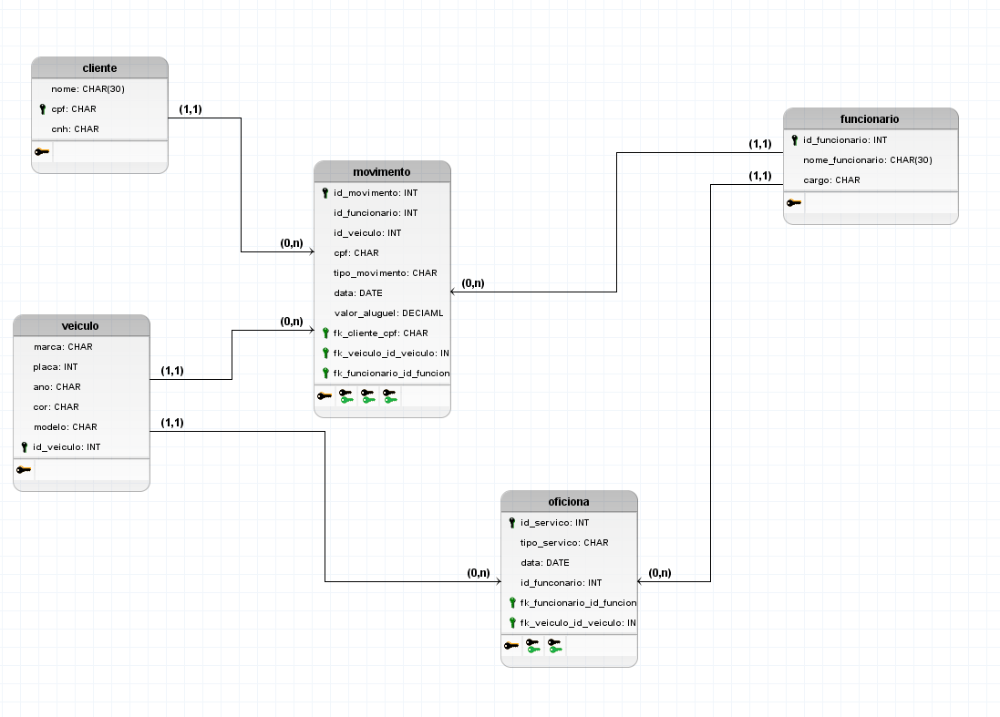
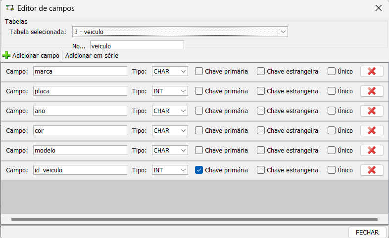
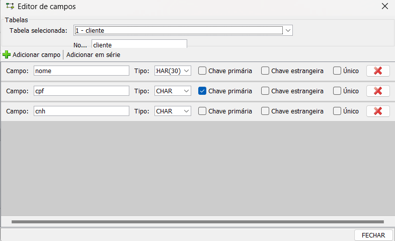
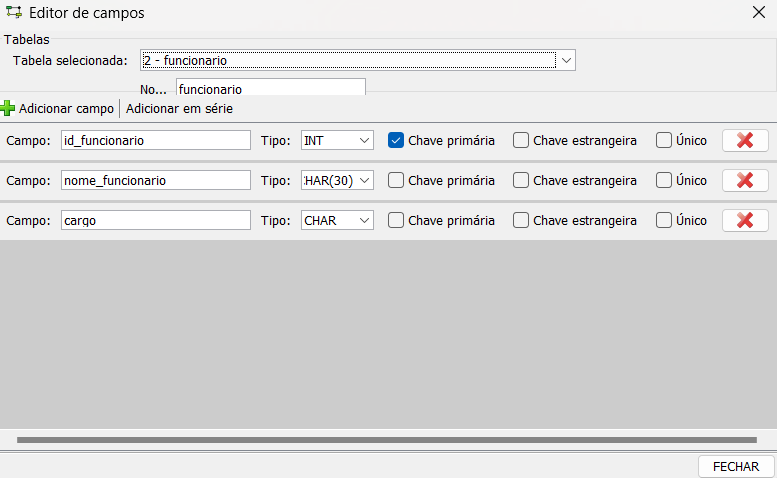
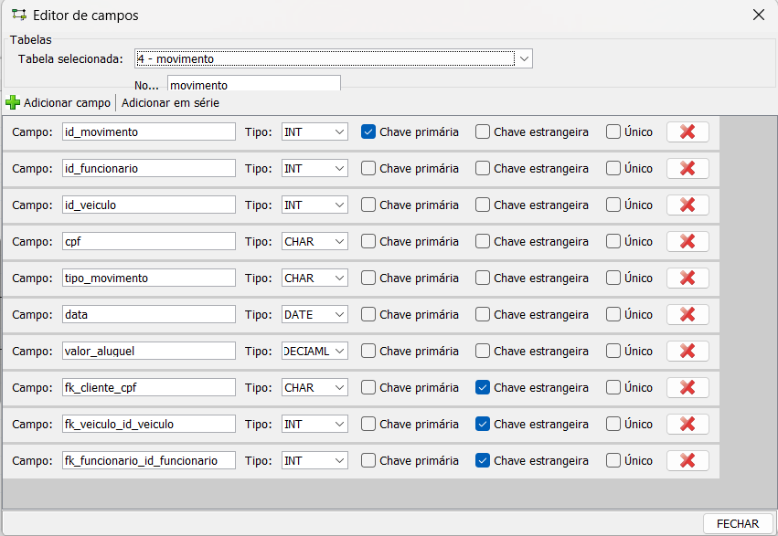
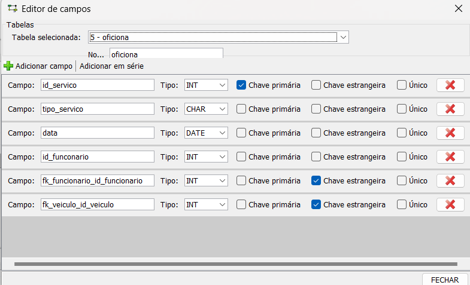
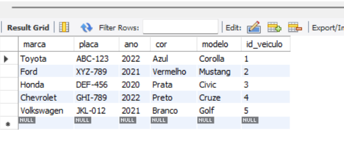

# Banco de dados para locadora de carros

Este foi um trabalho da matéria de banco de dados no qual foi dado para os alunos da turma o desafio de criar um banco de dados com MySQL para uma locadora de veículos seguindo alguns critérios

## Requisitos
 - Criar cinco tabelas (cliente, atendente, movimento, oficina, e veículos)
 - Cada uma das tabelas deveriam haver no mínimo cinco inserções
 - O banco de dados deveria conter também a criação de cinco usuários e cada usuário com privilégios diferentes
 - A concepção do bando de dados deveria ser incluso o modelo conceitual, lógico, e físico.

Obs.: para visualização dos modelos conceitual e lógico na sua máquina é necessário a instalação do [brModelo v3.31](http://www.sis4.com/brModelo/)

### Imagens dos modelos, tabelas e atributos

#### Modelo conceitual

#### Modelo lógico

### Atributos das tabelas de veículos, clientes, funcionários, movimentos, e oficina respectivamente

### Tabela de cliente, funcionários, veículos, movimento e oficina respectivamente

